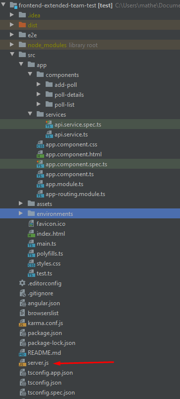
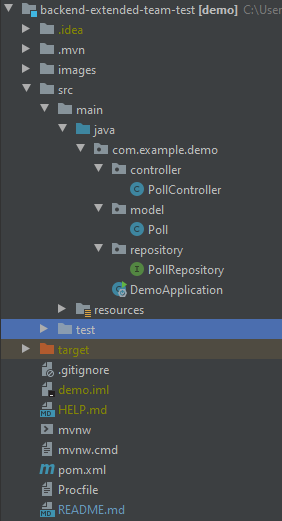

# Extended Team Test

This is my purposed solution for the Extended Team technical test. 

This is the source code for the front end only. To check the Java back end code, [click this link](https://github.com/ghostproducer/backend-extended-team-test).

### The Task

Desired features, in order of priority:

- A user can come to the webpage and create a new poll. [x]

- The user should be able to specify a title for the poll, a brief description, and a list of options. [x]

- After the poll is created, the user should be able to edit the poll, and modify anything they specified originally. [x]

- After the poll is created, the user should be able to share their poll with their friends. This can be as simple as generating a link that they can have other people go to to respond to the poll. [x]

- The user should be able to view a graph of the responses to their poll. [x]

- A user responding to a poll should be able to edit their response. (You do not need to authenticate users attempting to edit responses)

- A user should be able to create an account that they can authenticate to with a username and password.

- The only information you need is a username and password. If email addresses are usernames, you do not need to validate the email address.

- Passwords must be securely stored.

- Rate-limiting of authentication requests and account lockout do not need to be implemented.

- A user should be able to associate all of their previously created polls with that account.

- The user, when authenticated, should be able to view all of the polls associated with their account.

- The user should be able to require all respondents to their polls authenticate before being able to respond to the poll.

### Tech Stack

For solving this test, the front end is treated as a separated part from backend. The front end was built using Angular 9, the back end was built using Java 8 + SpringBoot, and the database is being hosted in my private AWS RDS, in a MySQL database.

For quick testing the app in a ambient similar to a production environment, it was deployed in a CI/CD pipeline service known as heroku. The deployed version can be accessed in [this link](https://frontend-extended-team-test.herokuapp.com/). Everytime a new code was pushed to the master branch, the heroku pipeline automatically detects the changes, and built it in a certain url.

### Front End Structure



The front end app was built using the Angular CLI command `ng new test` to create a new Angular Project.
There are 3 components: `poll-list`, `poll-details`, `add-poll`.

– `api.service.ts` has methods for sending HTTP requests to the backend API.

– `app-routing.module.ts` defines routes for each component.

– `app.component.ts` contains router view and navigation bar.

– `app.module.ts` declares Angular components and import necessary modules.

The `server.js` file is a NodeJs file that is being used to deploy the angular app to heroku.

### Back End Structure



The back end was built using Java 8 + Spring Boot + Maven. The `pom.xml` file was generated using the [Spring Initializr service](https://start.spring.io/).

– `Poll` data model class corresponds to entity and table poll.

– `PollRepository` is an interface that extends JpaRepository for CRUD methods and custom finder methods.

– `PollController` is a RestController which has request mapping methods for RESTful requests such as: getAllPolls, createPoll, updatePoll, deletePoll, etc.

– Configuration for Spring Datasource and the MySQL database is in `application.properties`.

– `pom.xml` contains dependencies for Spring Boot and PostgreSQL.

#### Poll Controller API Overview

The REST API to handle all the requests from the front end is defined at the `PollController` class. It implements the most commom CRUD requests.

|   Methods    |  URL                           | Action                                        |
| :---         | :---                           | :---                                          |
| POST         | /api/poll                      | create new poll                               |
| GET          | /api/poll                      | retrieve all polls                            |
| GET          | /api/poll/:id                  | retrieve a poll by `:id`                      |
| PUT          | /api/poll/:id                  | update a poll by `:id`                        |
| DELETE       | /api/poll/:id                  | delete a poll by `:id`                        |
| DELETE       | /api/poll                      | delete all polls                              |
| GET          | /api/poll/published            | retrieve all polls that has a published URL   |
| GET          | /api/poll?title=[keyword]      | find all polls which title contais `[keyword]`|                    |
| POST         | /api/poll/:id/:option          | vote in a option in a specified poll

### Database Structure

The current database is being currently hosted in a AWS RDS db.t2.micro personal instance, running MySQl Community.
All info is being saved in a single table, called simply `polls`.

### Local Setup

To run it in your localhost, you need to start the back end and the front end as different services.

To start the back end:  

```
git clone https://github.com/ghostproducer/backend-extended-team-test
cd backend-extended-team-test-master/
mvn clean install
mvn spring-boot:run
```

To start the front end, open a new terminal instance: 
```
git clone https://github.com/ghostproducer/frontend-backend-extended-team-test
cd frontend-extended-team-test-master/
npm install
ng serve
```

The application can then be accessed in the browser, trough the url http://localhost:4200/

### Heroku Deployment

Even tough it was not requested to deploy the app in a production environment, Heroku provides a simple alternative to test the app in a real world approach.

To publish this app in the internet, two heroku instances were created, one for the front end, and other for the back end.

The back end exposes the API endpoint in the heroku app url, which is accessed by the front end REST requests.
